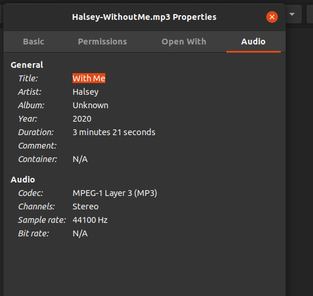
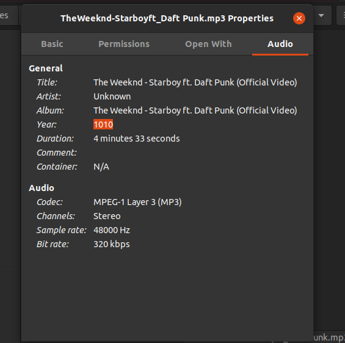

# Text metainformation editor for MP3 files
Metainformation standard is [ID3v2](https://id3.org/id3v2.3.0).
The editor is a console program that accepts filename as an argument `--filepath` and also one of the following commands:
1) `--show` - show all the metainformation in a table
2) `--set=prop_name  --value=prop_value` - set value of the field named *prop_name* to *prop_value*
3) `--get=prop_name` - print value of the field named *prop_name* 

Examples: 
* `app.exe --filepath=Song.mp3 --show`
* `app.exe --filepath=Song.mp3 --get=TIT2`
* `app.exe --filepath=Song.mp3 --set=COMM --value=Test`

These are results you can get:

